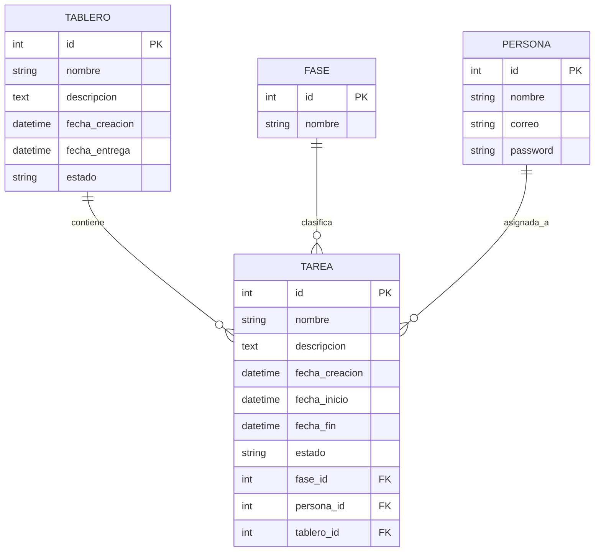

# 📋 Gestor de Tareas API

Una API REST completa para la gestión de tareas, proyectos, fases y personas, desarrollada con Flask y documentada con Swagger UI.


<!--  -->

## 🚀 Tecnologías Utilizadas

### Backend Framework
- **Flask** `2.3+` - Framework web minimalista de Python
- **Flask-RESTX** `1.3+` - Extensión para APIs REST con documentación Swagger automática
- **Flask-CORS** `4.0+` - Manejo de CORS (Cross-Origin Resource Sharing)

### Base de Datos
- **SQLAlchemy** `2.0+` - ORM (Object-Relational Mapping) para manejo de base de datos
- **SQLite** `3.0+` - Base de datos ligera para desarrollo local

### Documentación y API
- **Swagger UI** - Interfaz interactiva para probar endpoints
- **OpenAPI 3.0** - Especificación estándar para documentación de APIs

### Herramientas de Desarrollo
- **Python** `3.13+` - Lenguaje de programación principal
- **Git** - Control de versiones
- **Virtual Environment** - Aislamiento de dependencias

## 📁 Estructura del Proyecto

```
proyecto_backend/
├── 📄 app.py                      # Aplicación Flask básica
├── 📄 my_project.db               # Base de datos SQLite (auto-generada)
├── 📄 README.md                   # Documentación del proyecto
├── 📄 .gitignore                  # Archivos excluidos del control de versiones
├── 📄 requirements.txt            # Dependencias Python
│
├── 📁 src/                        # Código fuente principal
│   ├── 📁 models/                 # Modelos de datos (SQLAlchemy)
│   │   ├── 📄 __init__.py         # Configuración de BD y sesiones
│   │   ├── 📄 tarea_m.py          # Modelo: Tarea (tareas del proyecto)
│   │   ├── 📄 tablero_m.py        # Modelo: Tablero (proyectos/boards)
│   │   ├── 📄 fase_m.py           # Modelo: Fase (etapas del proyecto)
│   │   ├── 📄 persona_m.py        # Modelo: Persona (usuarios/miembros)
│   │   └── 📄 persona.py          # Modelo legacy (deprecado)
│   │
│   └── 📁 controller/             # Controladores de API
│       ├── 📄 tareas_c.py         # Controlador Flask básico
│       ├── 📄 tareas_restx.py     # Controlador Tareas con Swagger ⭐
│       ├── 📄 tablero_restx.py    # Controlador Tableros con Swagger ⭐
│       ├── 📄 fase_restx.py       # Controlador Fases con Swagger ⭐
│       └── 📄 persona_restx.py    # Controlador Personas con Swagger ⭐

└── 📁 .venv/                      # Entorno virtual Python (ignorado por Git)
```

## 🛠️ Instalación y Configuración

### 1. Prerequisitos
- Python 3.13+ instalado
- Git instalado
- Terminal/CMD con acceso a pip

### 2. Clonar el repositorio
```bash
git clone https://github.com/JeidKata/backend-gestor-tareas.git
```

### 3. Crear y activar entorno virtual
```bash
# Crear entorno virtual
python -m venv .venv

# Activar entorno virtual
# Windows
.venv\Scripts\activate

# Linux/macOS
source .venv/bin/activate
```

### 4. Instalar dependencias
```bash
pip install flask flask-restx flask-cors sqlalchemy
```

### 5. Ejecutar la aplicación
```bash
flask run

# Alternativa: versión básica
python app.py
```

### 6. Acceder a la aplicación
- **API Principal**: `http://localhost:5000/`
- **Documentación Swagger**: `http://localhost:5000/docs/` 📖
- **Especificación OpenAPI**: `http://localhost:5000/swagger.json`

## 📊 Modelos de Datos

### 🏗️ Arquitectura de Entidades



### 📝 **Tarea** (`src/models/tarea_m.py`)
Representa las tareas individuales del proyecto.

**Campos:**
- `id` (PK) - Identificador único
- `nombre` - Título de la tarea
- `descripcion` - Descripción detallada
- `fecha_creacion` - Timestamp de creación (auto)
- `fecha_inicio` - Fecha programada de inicio
- `fecha_fin` - Fecha programada de finalización
- `estado` - Estado actual (`pendiente`, `en_progreso`, `completada`)

**Relaciones:**
- Pertenece a un `Tablero` (proyecto)
- Clasificada en una `Fase`
- Asignada a una `Persona` (opcional)

### 📊 **Tablero** (`src/models/tablero_m.py`)
Representa proyectos o tableros que contienen múltiples tareas.

**Campos:**
- `id` (PK) - Identificador único
- `nombre` - Nombre del proyecto/tablero
- `descripcion` - Descripción del proyecto
- `fecha_creacion` - Timestamp de creación (auto)
- `fecha_entrega` - Deadline del proyecto
- `estado` - Estado (`activo`, `completado`, `en_espera`)

**Relaciones:**
- Contiene múltiples `Tareas`

### 🎯 **Fase** (`src/models/fase_m.py`)
Representa las etapas o fases del desarrollo.

**Campos:**
- `id` (PK) - Identificador único
- `nombre` - Nombre de la fase (ej: "Análisis", "Desarrollo")

**Ejemplos comunes:**
- Planificación
- Análisis
- Diseño
- Desarrollo
- Testing
- Producción

### 👥 **Persona** (`src/models/persona_m.py`)
Representa usuarios o miembros del equipo.

**Campos:**
- `id` (PK) - Identificador único
- `nombre` - Nombre completo
- `correo` - Email único
- `password` - Contraseña (⚠️ texto plano - solo desarrollo)

**Relaciones:**
- Puede tener múltiples `Tareas` asignadas

## 🌐 API Endpoints

### 📖 **Documentación y Metadata**
| Método | Endpoint | Descripción |
|--------|----------|-------------|
| GET | `/` | Información general de la API |
| GET | `/docs/` | 📋 Interfaz Swagger UI interactiva |
| GET | `/swagger.json` | Especificación OpenAPI JSON |

### 📝 **Tareas** (`/api/v1/tareas`)
| Método | Endpoint | Descripción | Parámetros |
|--------|----------|-------------|------------|
| GET | `/api/v1/tareas/` | Listar todas las tareas | - |
| POST | `/api/v1/tareas/` | Crear nueva tarea | `nombre`, `descripcion`, `fecha_inicio`, etc. |
| GET | `/api/v1/tareas/{id}g` | Obtener tarea específica | `id` (path) |
| PUT | `/api/v1/tareas/{id}p` | Actualizar tarea completa | `id` (path) + campos |
| DELETE | `/api/v1/tareas/{id}d` | Eliminar tarea | `id` (path) |

### 📊 **Tableros** (`/api/v1/tableros`)
| Método | Endpoint | Descripción | Parámetros |
|--------|----------|-------------|------------|
| GET | `/api/v1/tableros/` | Listar todos los tableros | - |
| POST | `/api/v1/tableros/` | Crear nuevo tablero | `nombre`, `descripcion`, `fecha_entrega`, `estado` |
| GET | `/api/v1/tableros/{id}g` | Obtener tablero específico | `id` (path) |
| PUT | `/api/v1/tableros/{id}p` | Actualizar tablero | `id` (path) + campos |
| DELETE | `/api/v1/tableros/{id}d` | Eliminar tablero | `id` (path) |

### 🎯 **Fases** (`/api/v1/fases`)
| Método | Endpoint | Descripción | Parámetros |
|--------|----------|-------------|------------|
| GET | `/api/v1/fases/` | Listar todas las fases | - |
| POST | `/api/v1/fases/` | Crear nueva fase | `nombre` |
| GET | `/api/v1/fases/{id}g` | Obtener fase específica | `id` (path) |
| PUT | `/api/v1/fases/{id}p` | Actualizar fase | `id` (path) + campos |
| DELETE | `/api/v1/fases/{id}d` | Eliminar fase | `id` (path) |

### 👥 **Personas** (`/api/v1/personas`)
| Método | Endpoint | Descripción | Parámetros |
|--------|----------|-------------|------------|
| GET | `/api/v1/personas/` | Listar todas las personas | - |
| POST | `/api/v1/personas/` | Crear nueva persona | `nombre`, `correo`, `password` |
| GET | `/api/v1/personas/{id}g` | Obtener persona específica | `id` (path) |
| PUT | `/api/v1/personas/{id}p` | Actualizar persona | `id` (path) + campos |
| DELETE | `/api/v1/personas/{id}d` | Eliminar persona | `id` (path) |

## 📋 Ejemplos de Uso

### 🚀 Crear una Tarea Completa
```bash
curl -X POST http://localhost:5000/api/v1/tareas/ \
  -H "Content-Type: application/json" \
  -d '{
    "nombre": "Implementar autenticación JWT",
    "descripcion": "Agregar sistema de login con tokens JWT y middleware de autenticación",
    "fecha_inicio": "2025-01-26T09:00:00",
    "fecha_fin": "2025-01-30T17:00:00",
    "estado": "pendiente",
    "fase_id": 2,
    "tablero_id": 1,
    "persona_id": 3
  }'
```

**Respuesta esperada:**
```json
{
  "mensaje": "Tarea creada exitosamente",
  "tarea": {
    "id": 15,
    "nombre": "Implementar autenticación JWT",
    "descripcion": "Agregar sistema de login con tokens JWT y middleware de autenticación",
    "fecha_creacion": "2025-01-26T14:30:45.123456",
    "fecha_inicio": "2025-01-26T09:00:00",
    "fecha_fin": "2025-01-30T17:00:00",
    "estado": "pendiente",
    "fase_id": 2,
    "persona_id": 3,
    "tablero_id": 1
  }
}
```

### 📊 Crear un Proyecto/Tablero
```bash
curl -X POST http://localhost:5000/api/v1/tableros/ \
  -H "Content-Type: application/json" \
  -d '{
    "nombre": "E-commerce Platform v2.0",
    "descripcion": "Desarrollo completo de plataforma de comercio electrónico con panel administrativo",
    "fecha_entrega": "2025-04-15T23:59:59",
    "estado": "activo"
  }'
```

### 🎯 Crear Fases del Proyecto
```bash
# Fase 1: Análisis
curl -X POST http://localhost:5000/api/v1/fases/ \
  -H "Content-Type: application/json" \
  -d '{"nombre": "Análisis y Planificación"}'

# Fase 2: Desarrollo
curl -X POST http://localhost:5000/api/v1/fases/ \
  -H "Content-Type: application/json" \
  -d '{"nombre": "Desarrollo Backend"}'

# Fase 3: Testing
curl -X POST http://localhost:5000/api/v1/fases/ \
  -H "Content-Type: application/json" \
  -d '{"nombre": "Testing y QA"}'
```

### 👥 Registrar Miembros del Equipo
```bash
curl -X POST http://localhost:5000/api/v1/personas/ \
  -H "Content-Type: application/json" \
  -d '{
    "nombre": "María González",
    "correo": "maria.gonzalez@empresa.com",
    "password": "temp123"
  }'
```

### 📋 Obtener Todas las Tareas de un Proyecto
```bash
# Listar todas las tareas
curl -X GET http://localhost:5000/api/v1/tareas/

# Obtener tarea específica
curl -X GET http://localhost:5000/api/v1/tareas/15g
```

## 🔧 Configuración Avanzada

### 🗄️ Configuración de Base de Datos (`src/models/__init__.py`)
```python
# Configuración SQLite para desarrollo
DATABASE_URL = "sqlite:///my_project.db"
engine = create_engine(DATABASE_URL)

# Configuración de sesiones
SessionLocal = sessionmaker(
    autocommit=False, 
    autoflush=False, 
    bind=engine
)

# Sesión scoped para threading
session = scoped_session(SessionLocal)

# Auto-creación de tablas
Base.metadata.create_all(bind=engine)
```

### 🌐 Configuración CORS (`app_con_swagger.py`)
```python
# Configuración CORS para desarrollo
cors = CORS(app)
app.config['CORS_HEADERS'] = 'Content-Type'

# En producción, especificar orígenes permitidos:
# CORS(app, origins=["https://tudominio.com"])
```

### 📖 Configuración Swagger
```python
api = Api(
    app, 
    doc='/docs/',  # URL de documentación
    title='Gestor de Tareas API',
    version='1.0',
    description='API REST para gestión de tareas, proyectos y fases',
    contact='tu-email@ejemplo.com',
    authorizations={
        'apikey': {
            'type': 'apiKey',
            'in': 'header',
            'name': 'X-API-KEY'
        }
    }
)
```

## 🧪 Testing y Desarrollo

### 🔍 Probar la API con Swagger UI
1. **Ejecutar aplicación**: `python app_con_swagger.py`
2. **Abrir navegador**: `http://localhost:5000/docs/`
3. **Explorar endpoints** en la interfaz interactiva
4. **Ejecutar pruebas** directamente desde el navegador
5. **Ver respuestas** en tiempo real

### 🛠️ Herramientas de Desarrollo Recomendadas
- **Swagger UI** - Pruebas interactivas integradas
- **Postman** - Cliente de API avanzado
- **DB Browser for SQLite** - Visualizador de base de datos
- **VS Code** - Editor con extensiones Python y REST Client
- **curl** - Pruebas desde terminal

### 📊 Monitoreo de Base de Datos
```bash
# Ver tablas creadas
sqlite3 my_project.db ".tables"

# Ver esquema de tabla
sqlite3 my_project.db ".schema tarea"

# Consultar datos
sqlite3 my_project.db "SELECT * FROM tarea LIMIT 5;"
```

## 🚀 Características Principales

### ✅ **Funcionalidades Implementadas**
- ✅ **CRUD Completo** - Crear, Leer, Actualizar, Eliminar para todas las entidades
- ✅ **Documentación Automática** - Swagger UI generado automáticamente
- ✅ **Validación de Datos** - Validación automática con Flask-RESTX
- ✅ **Manejo de Errores** - Respuestas HTTP apropiadas y mensajes descriptivos
- ✅ **Relaciones de BD** - Foreign keys y relaciones entre entidades
- ✅ **CORS Habilitado** - Configurado para desarrollo frontend
- ✅ **Interfaz de Pruebas** - Testing interactivo sin herramientas externas
- ✅ **Auto-creación de BD** - Base de datos se crea automáticamente
- ✅ **Sesiones Scoped** - Manejo seguro de transacciones

### 🏗️ **Patrones de Desarrollo**
- **🎯 MVC Pattern** - Separación clara entre Modelos, Vistas y Controladores
- **🔄 Repository Pattern** - Métodos de clase para operaciones de datos
- **🌐 RESTful API** - Endpoints siguiendo convenciones REST estándar
- **📋 OpenAPI** - Documentación siguiendo estándares de la industria
- **🔗 Dependency Injection** - Inyección de dependencias con Flask-RESTX
- **🛡️ Error Handling** - Manejo consistente de errores y excepciones

### 📈 **Ventajas del Proyecto**
- **⚡ Desarrollo Rápido** - Setup mínimo, documentación automática
- **🔧 Mantenible** - Código organizado y bien estructurado
- **📖 Auto-documentado** - Swagger UI siempre actualizado
- **🧪 Testeable** - Interfaz de pruebas integrada
- **🔄 Escalable** - Arquitectura preparada para crecimiento
- **🎯 Estándares** - Siguiendo mejores prácticas de la industria

## 📈 Roadmap y Mejoras Futuras

### 🔮 **Próximas Versiones (v1.1 - v1.5)**

#### 🔐 **Seguridad y Autenticación**
- [ ] **JWT Authentication** - Sistema de tokens para autenticación
- [ ] **Password Hashing** - Encriptación bcrypt/argon2 de contraseñas
- [ ] **Role-based Access** - Roles y permisos por usuario
- [ ] **API Rate Limiting** - Límites de peticiones por IP/usuario
- [ ] **HTTPS Enforcement** - Redirección automática a HTTPS

#### 📊 **Funcionalidades Avanzadas**
- [ ] **Paginación** - Listados con paginación automática
- [ ] **Filtros y Búsqueda** - Búsqueda por texto, fechas, estado
- [ ] **Ordenamiento** - Sort por diferentes campos
- [ ] **Archivos Adjuntos** - Upload de archivos en tareas
- [ ] **Comentarios** - Sistema de comentarios en tareas
- [ ] **Notificaciones** - Alertas por email/push
- [ ] **Dashboard** - Métricas y estadísticas del proyecto

#### 🔧 **Mejoras Técnicas**
- [ ] **Validaciones Robustas** - Validaciones complejas con Pydantic
- [ ] **Logging Estructurado** - Logs JSON con diferentes niveles
- [ ] **Health Checks** - Endpoints de salud para monitoreo
- [ ] **API Versioning** - Versionado de API (/api/v2/)
- [ ] **Background Tasks** - Tareas asíncronas con Celery
- [ ] **Caching** - Redis para cache de consultas frecuentes

### 🚀 **Migración a Producción (v2.0)**

#### 🏗️ **Infraestructura**
- [ ] **PostgreSQL** - Migración de SQLite a PostgreSQL
- [ ] **Docker** - Containerización completa
- [ ] **Docker Compose** - Orquestación local
- [ ] **Kubernetes** - Deploy en clusters
- [ ] **Environment Config** - Variables de entorno para configuración
- [ ] **Secrets Management** - Gestión segura de secretos

#### 📈 **Monitoreo y Observabilidad**
- [ ] **Prometheus Metrics** - Métricas de aplicación
- [ ] **Grafana Dashboards** - Visualización de métricas
- [ ] **Application Monitoring** - APM con Sentry/DataDog
- [ ] **Log Aggregation** - ELK Stack o similar
- [ ] **Alerting** - Alertas automáticas por errores

#### 🔄 **CI/CD y DevOps**
- [ ] **GitHub Actions** - Pipeline de CI/CD
- [ ] **Automated Testing** - Tests unitarios y de integración
- [ ] **Code Quality** - SonarQube, linting automático
- [ ] **Security Scanning** - Análisis de vulnerabilidades
- [ ] **Blue-Green Deployment** - Deploy sin downtime

### 🌟 **Funcionalidades Premium (v3.0)**
- [ ] **Multi-tenancy** - Soporte para múltiples organizaciones
- [ ] **Advanced Analytics** - BI y reportes avanzados
- [ ] **Mobile API** - Optimizaciones para apps móviles
- [ ] **Real-time Updates** - WebSockets para actualizaciones en tiempo real
- [ ] **AI/ML Integration** - Predicción de deadlines, sugerencias automáticas
- [ ] **Third-party Integrations** - Slack, Jira, GitHub, etc.

## 🤝 Contribución y Colaboración

### 📋 **Cómo Contribuir**

1. **🍴 Fork** del repositorio
2. **🌿 Crear rama** feature (`git checkout -b feature/nueva-funcionalidad`)
3. **✍️ Commit** cambios (`git commit -m 'feat: agregar nueva funcionalidad'`)
4. **🚀 Push** a la rama (`git push origin feature/nueva-funcionalidad`)
5. **📝 Crear** Pull Request con descripción detallada

### 📏 **Estándares de Código**

#### 🐍 **Python Style Guide**
- **PEP 8** - Seguir convenciones de estilo de Python
- **Type Hints** - Usar tipado estático donde sea posible
- **Docstrings** - Documentar funciones y clases
- **Black** - Formateador automático de código

#### 📝 **Convenciones de Commit**
```
feat: nueva funcionalidad
fix: corrección de bug
docs: cambios en documentación
style: formateo de código
refactor: refactorización
test: agregar o modificar tests
chore: tareas de mantenimiento
```

#### 🏗️ **Estructura de Pull Request**
- **Título claro** y descriptivo
- **Descripción detallada** de cambios
- **Screenshots** si aplica
- **Tests** que cubran los cambios
- **Documentación** actualizada

### 🐛 **Reportar Issues**

#### 🔍 **Template de Bug Report**
```markdown
**Descripción del Bug**
Descripción clara y concisa del problema.

**Pasos para Reproducir**
1. Ir a '...'
2. Hacer clic en '....'
3. Scrollear hasta '....'
4. Ver error

**Comportamiento Esperado**
Descripción de lo que esperabas que pasara.

**Screenshots**
Si aplica, agregar screenshots del problema.

**Información del Entorno**
- OS: [ej. Windows 10]
- Python: [ej. 3.13.1]
- Flask: [ej. 2.3.3]
```

### 💡 **Solicitar Features**
- **Descripción clara** del feature solicitado
- **Justificación** del por qué es necesario
- **Casos de uso** específicos
- **Mockups** o ejemplos si aplica

## 📞 Información de Contacto

### 👨‍💻 **Equipo de Desarrollo**
- **Desarrollador Principal**: Jeidy Olaya
<!-- - **Email**: `tu-email@ejemplo.com` -->
- **LinkedIn**: `linkedin.com/in/jeidy-olaya`
- **GitHub**: `github.com/JeidKata`

### 🌐 **Enlaces del Proyecto**
- **🏠 Repositorio**: `github.com/JeidKata/backend-gestor-tareas`
<!-- - **📖 Documentación**: `JeidKata.github.io/backend-gestor-tareas` -->
- **🐛 Issues**: `github.com/JeidKata/backend-gestor-tareas/issues`
<!-- - **💬 Discussions**: `github.com/JeidKata/backend-gestor-tareas/discussions` -->

<!-- ### 📧 **Soporte**
- **📧 Email de Soporte**: `soporte@tu-proyecto.com`
- **💬 Chat**: `discord.gg/tu-servidor` o `slack.com/tu-workspace`
- **📱 Twitter**: `@tu_proyecto` -->

<!-- ## 📄 Licencia

Este proyecto está licenciado bajo la **MIT License** - ver el archivo [LICENSE](LICENSE) para más detalles.

```
MIT License

Copyright (c) 2025 Jeidy Olaya

Permission is hereby granted, free of charge, to any person obtaining a copy
of this software and associated documentation files (the "Software"), to deal
in the Software without restriction, including without limitation the rights
to use, copy, modify, merge, publish, distribute, sublicense, and/or sell
copies of the Software...
``` -->

## 📚 Recursos Adicionales

### 📖 **Documentación Técnica**
- [Flask Documentation](https://flask.palletsprojects.com/)
- [Flask-RESTX Documentation](https://flask-restx.readthedocs.io/)
- [SQLAlchemy Documentation](https://docs.sqlalchemy.org/)
- [Swagger/OpenAPI Specification](https://swagger.io/specification/)

### 🎓 **Tutoriales y Guías**
- [REST API Best Practices](https://restfulapi.net/)
- [SQLAlchemy ORM Tutorial](https://docs.sqlalchemy.org/en/20/orm/tutorial.html)
- [Flask Mega-Tutorial](https://blog.miguelgrinberg.com/post/the-flask-mega-tutorial-part-i-hello-world)

### 🛠️ **Herramientas Útiles**
- [Postman](https://www.postman.com/) - Cliente de API
- [DB Browser for SQLite](https://sqlitebrowser.org/) - Visor de base de datos
- [Visual Studio Code](https://code.visualstudio.com/) - Editor recomendado

---

<div align="center">

### 🎯 **¡API Lista para Usar!**

**Accede a [`http://localhost:5000/docs/`](http://localhost:5000/docs/) para comenzar a explorar todas las funcionalidades**

⭐ **¡No olvides dar una estrella al repositorio si te fue útil!** ⭐

[](https://github.com/JeidKata)

</div>